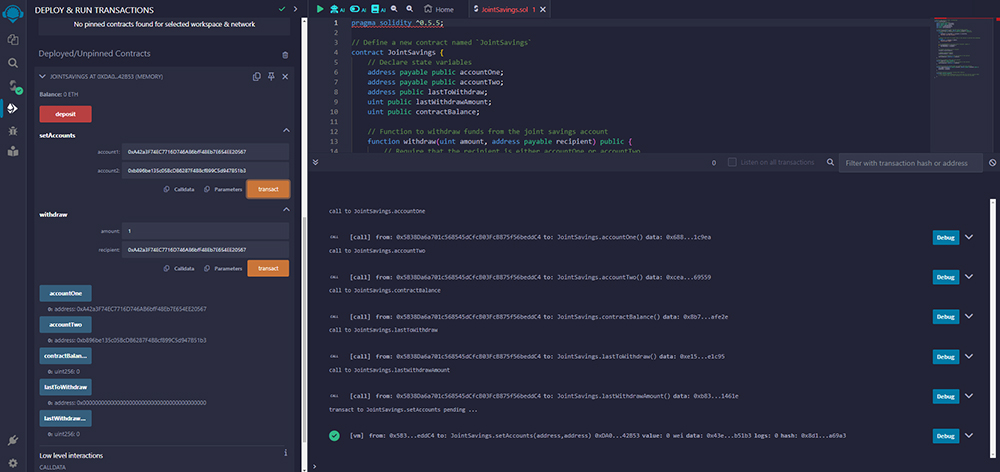

# Joint Savings Account Smart Contract

## Project Overview
This project features a Solidity smart contract aimed at simulating a joint savings account. The `JointSavings` contract allows two users to control and manage a joint savings account by depositing and withdrawing Ether (ETH) in a simulated environment. This contract was developed to meet the requirements of a fintech startup aiming to implement blockchain solutions for cross-border, Ethereum-compatible financial services.

## Features
- **Dual Account Management:** The contract supports two user addresses that can independently access the funds.
- **Deposit Functionality:** Users can deposit Ether into the joint savings account.
- **Withdrawal Functionality:** Users can withdraw Ether from the account, provided they are one of the registered account holders and sufficient funds are available.
- **Fallback Function:** The contract can receive Ether sent directly to its address outside of the deposit function.

## Contract Functions
### `withdraw(uint amount, address payable recipient)`
Allows a withdrawal from the account by one of the authorized addresses.
- **Parameters:**
  - `amount`: The amount of Ether (in wei) to be withdrawn.
  - `recipient`: The payable address of the recipient performing the withdrawal.
- **Requirements:**
  - The recipient must be either `accountOne` or `accountTwo`.
  - The contract must have sufficient balance.

### `deposit()`
Deposits the sent amount of Ether into the joint savings account.
- **Note:** The function is `payable` and updates the `contractBalance` with the current balance.

### `setAccounts(address payable account1, address payable account2)`
Sets the authorized addresses able to withdraw from the account.
- **Parameters:**
  - `account1`: The first authorized account.
  - `account2`: The second authorized account.

### Fallback Function
Receives Ether sent directly to the contract's address.

## Setup and Testing
### Requirements
- Solidity ^0.5.5
- Remix IDE for deployment and testing
- JavaScript VM environment in Remix for simulation

### Deployment
1. Open Remix IDE and paste the contract code into a new `.sol` file.
2. Compile the contract using the Solidity compiler version 0.5.5.
3. Deploy the contract in the JavaScript VM environment.

### Interacting with the Contract
- Use the `setAccounts` function to specify which addresses can manage the funds.
- Use the `deposit` function to add Ether to the account.
- Use the `withdraw` function to remove Ether from the account, ensuring to handle permissions and balance checks.

## Screenshots

