# Joint Savings Account Smart Contract

## Project Overview
This project features a Solidity smart contract aimed at simulating a joint savings account. The `JointSavings` contract allows two users to control and manage a joint savings account by depositing and withdrawing Ether (ETH) in a simulated environment. This contract was developed to meet the requirements of a fintech startup aiming to implement blockchain solutions for cross-border, Ethereum-compatible financial services.

```solidity
pragma solidity ^0.5.5;

// Define a new contract named `JointSavings`
contract JointSavings {
    // Declare state variables
    address payable public accountOne;
    address payable public accountTwo;
    address public lastToWithdraw;
    uint public lastWithdrawAmount;
    uint public contractBalance;

    // Function to withdraw funds from the joint savings account
    function withdraw(uint amount, address payable recipient) public {
        // Require that the recipient is either accountOne or accountTwo
        require(
            recipient == accountOne || recipient == accountTwo,
            "You don't own this account!"
        );

        // Require that there are enough funds in the contract to perform the withdrawal
        require(
            address(this).balance >= amount,
            "Insufficient funds!"
        );

        // If lastToWithdraw is not the current recipient, update it
        if (lastToWithdraw != recipient) {
            lastToWithdraw = recipient;
        }

        // Transfer the amount to the recipient
        recipient.transfer(amount);

        // Update lastWithdrawAmount
        lastWithdrawAmount = amount;

        // Update contractBalance to the new balance of the contract
        contractBalance = address(this).balance;
    }

    // Function to deposit funds into the contract
    function deposit() public payable {
        // Update contractBalance to the new balance of the contract
        contractBalance = address(this).balance;
    }

    // Function to set the accounts that can withdraw from this contract
    function setAccounts(address payable account1, address payable account2) public {
        accountOne = account1;
        accountTwo = account2;
    }

    // Fallback function to accept incoming Ether deposits
    function() external payable {
        // This function will automatically be called when the contract receives Ether
        // if it doesn't match any other function or if no data was provided.
    }
}
```

## Features
- **Dual Account Management:** The contract supports two user addresses that can independently access the funds.
- **Deposit Functionality:** Users can deposit Ether into the joint savings account.
- **Withdrawal Functionality:** Users can withdraw Ether from the account, provided they are one of the registered account holders and sufficient funds are available.
- **Fallback Function:** The contract can receive Ether sent directly to its address outside of the deposit function.

## Contract Functions
### `withdraw(uint amount, address payable recipient)`
Allows a withdrawal from the account by one of the authorized addresses.
- **Parameters:**
  - `amount`: The amount of Ether (in wei) to be withdrawn.
  - `recipient`: The payable address of the recipient performing the withdrawal.
- **Requirements:**
  - The recipient must be either `accountOne` or `accountTwo`.
  - The contract must have sufficient balance.

### `deposit()`
Deposits the sent amount of Ether into the joint savings account.
- **Note:** The function is `payable` and updates the `contractBalance` with the current balance.

### `setAccounts(address payable account1, address payable account2)`
Sets the authorized addresses able to withdraw from the account.
- **Parameters:**
  - `account1`: The first authorized account.
  - `account2`: The second authorized account.

### Fallback Function
Receives Ether sent directly to the contract's address.

## Setup and Testing
### Requirements
- Solidity ^0.5.5
- Remix IDE for deployment and testing
- JavaScript VM environment in Remix for simulation

### Deployment
1. Open Remix IDE and paste the contract code into a new `.sol` file.
2. Compile the contract using the Solidity compiler version 0.5.5.
3. Deploy the contract in the JavaScript VM environment.

### Interacting with the Contract
- Use the `setAccounts` function to specify which addresses can manage the funds.
- Use the `deposit` function to add Ether to the account.
- Use the `withdraw` function to remove Ether from the account, ensuring to handle permissions and balance checks.

## Final Snapshots

### Initial Deploy
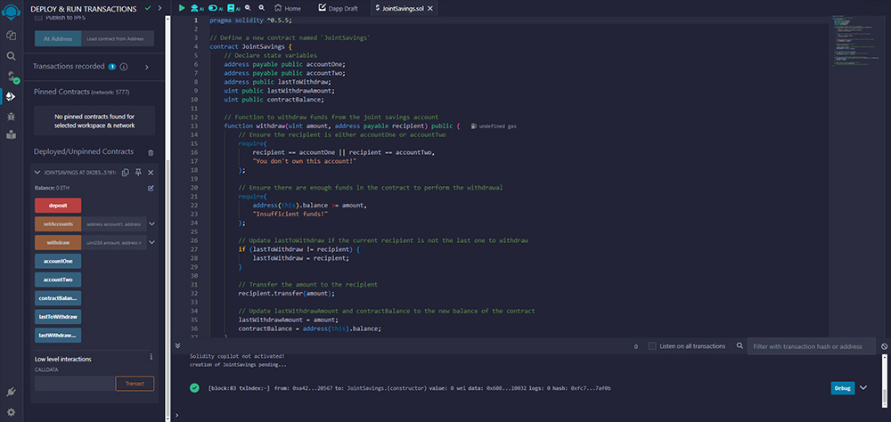

### Setting Accounts - Step 1
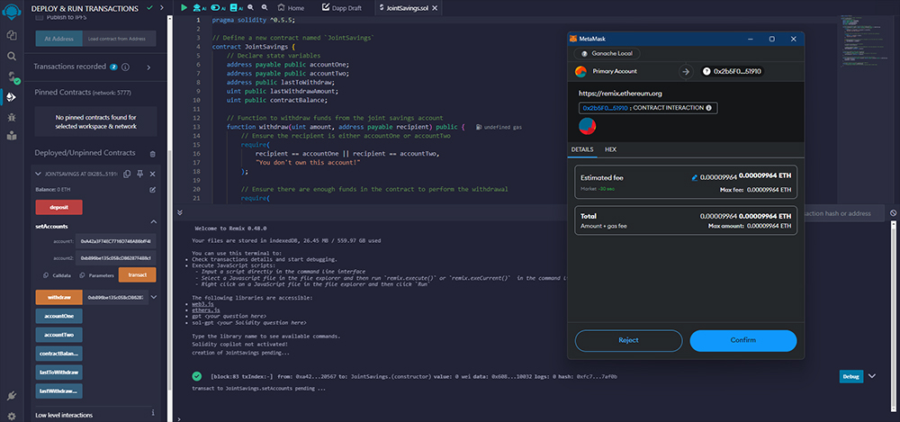

### Setting Accounts - Step 2
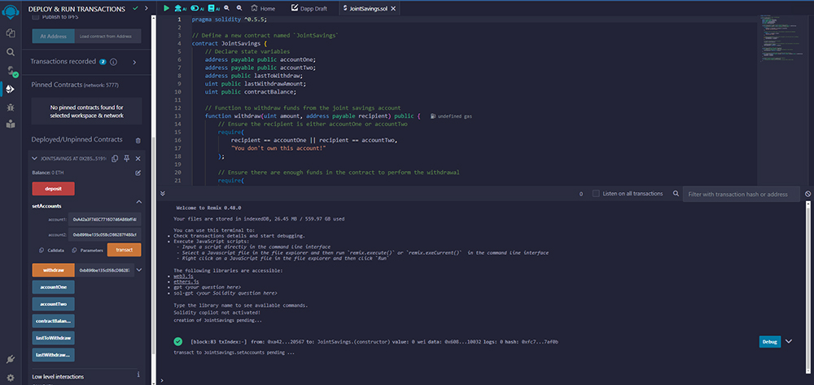

### Deposit of 1 ETH
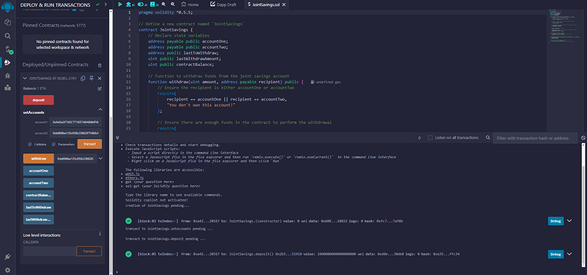

### Withdrawal After Deposit of 1 ETH
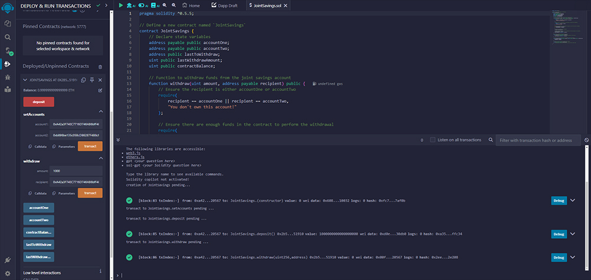

### Checking After Deposit and Withdrawl of 1 ETH
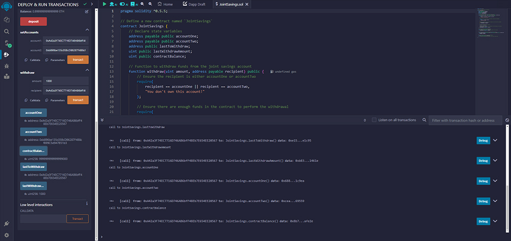

### Deposit of 5 ETH
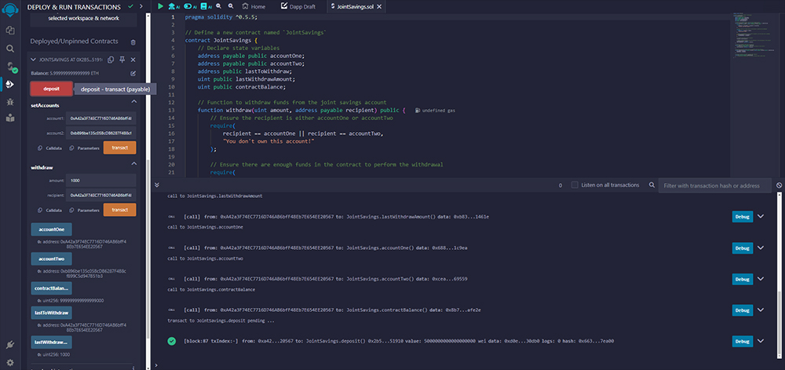

### Withdrawal After Deposit of 5 ETH
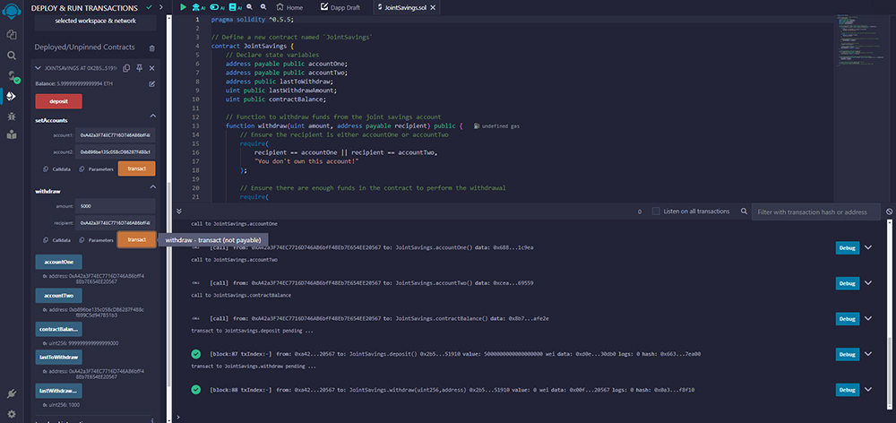

### Checking After Deposit and Withdrawl of 5 ETH
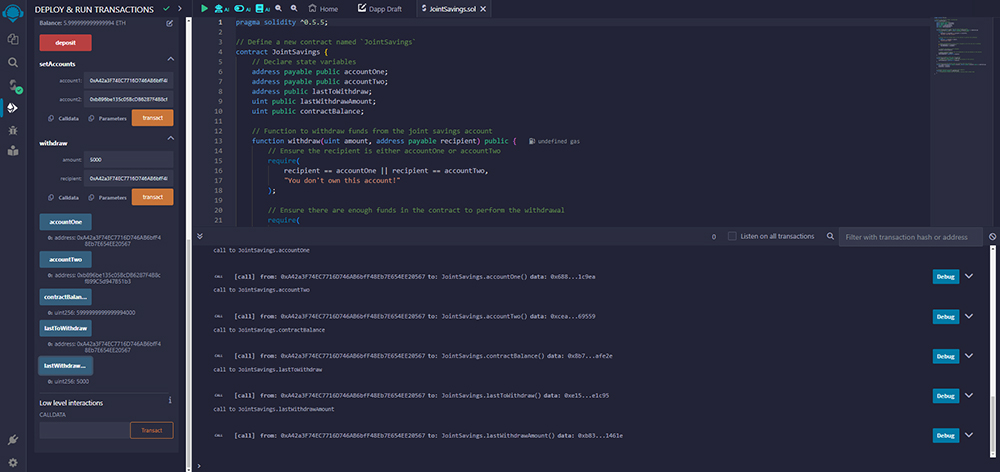

### Initial Deposit of 10 ETH
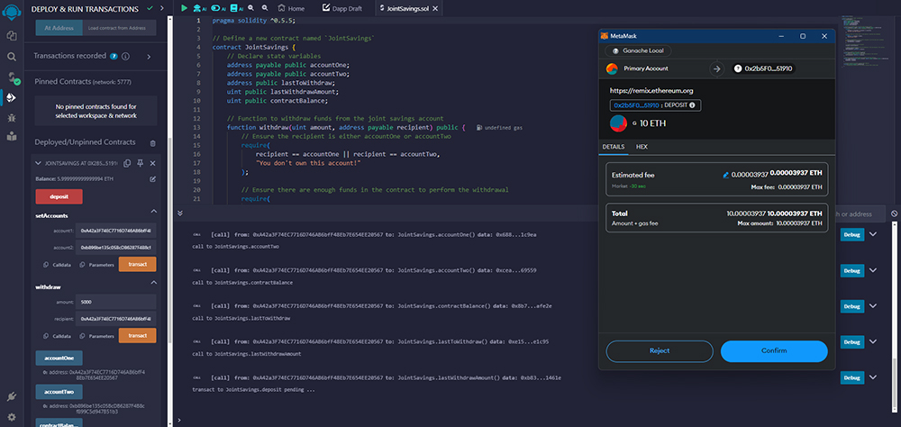
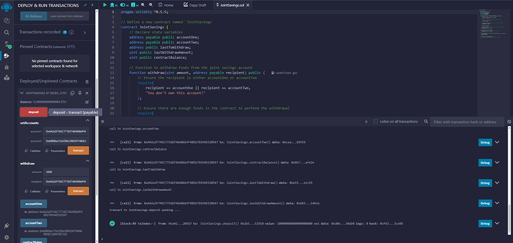

### Checking After Deposit of 10 ETH
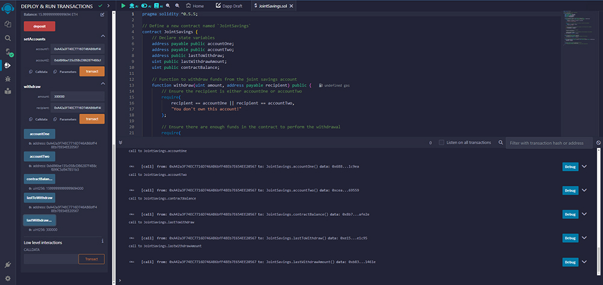

### Ganache Interface View
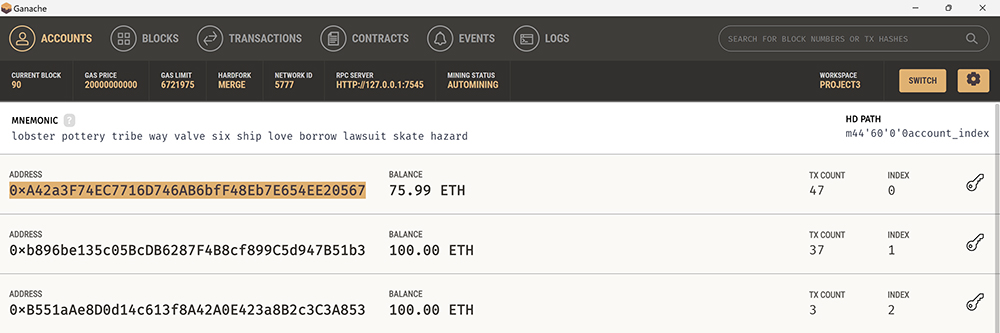

